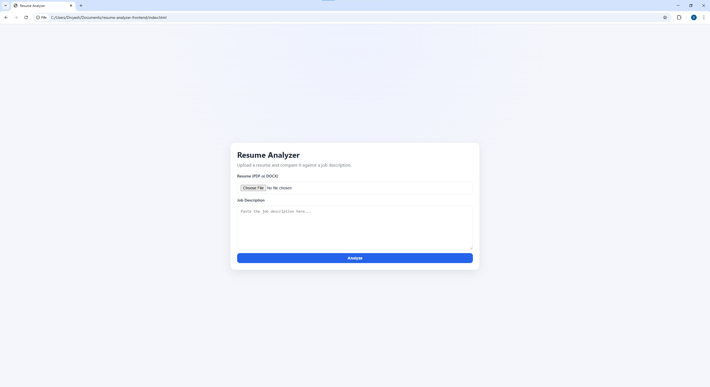
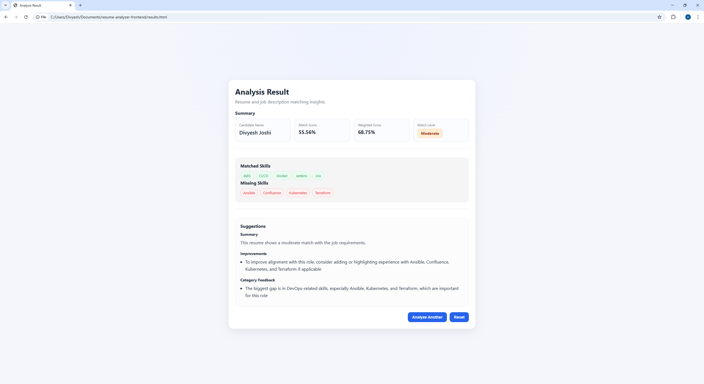

# Resume Analyzer

## Overview

Resume Analyzer is a backend-driven application built with FastAPI that evaluates how well a candidate’s resume matches a job description.

The system goes beyond simple keyword matching by introducing:
- category-aware skill analysis
- weighted scoring based on job requirements
- explainable feedback generation
- actionable suggestions for improvement

This project demonstrates how structured backend systems can simulate intelligent resume screening workflows.

---

## Key Features

- Resume upload support for PDF and DOCX
- Text extraction from resumes
- Contact detail extraction (name, email, phone, links)
- Alias-based skill extraction
- Job description skill extraction
- Matched, missing, and extra skill comparison
- Basic match score
- Weighted match score using skill categories
- Suggestion generation (summary, improvements, category feedback)
- Clean report endpoint for frontend usage
- Minimal frontend UI for interaction
- Dockerized backend and frontend
- Docker Compose setup
- Environment-based configuration using .env
- Unit tests and basic API tests using pytest

---

## Architecture

Resume Upload + Job Description  
        ↓  
FastAPI Backend  
        ↓  
Text Extraction  
        ↓  
Resume Parsing  
        ↓  
Skill Extraction  
        ↓  
Skill Matching  
        ↓  
Scoring + Suggestions  
        ↓  
Frontend Result Display  

---

## Tech Stack

### Backend
- Python
- FastAPI
- Uvicorn
- Pytest

### Frontend
- HTML
- CSS
- JavaScript

### DevOps
- Docker
- Docker Compose
- Environment Variables (.env)

### Parsing / NLP
- Regex
- Alias mapping
- JSON-based skill and category configuration

---

## Setup Instructions

### Local Backend Setup

cd backend  
python -m venv .venv  

Windows:
.venv\Scripts\activate  

pip install -r requirements.txt  
uvicorn app.main:app --reload  

---

### Run with Docker Compose

docker compose up --build  

Access:

Frontend: http://127.0.0.1:3000  
Backend Docs: http://127.0.0.1:8000/docs  

---

## API Endpoints

GET  /health  
Health check  

POST /parse_resume  
Extract resume details  

POST /analyze_resume_clean  
Full analysis (clean response)  

POST /analyze_resume_report  
Export-ready report  

---

## Example Response

```json
{
  "candidate_name": "John Doe",
  "match_level": "Low",
  "match_score": 22.22,
  "weighted_match_score": 45.83,
  "matched_skills": ["AWS", "Docker"],
  "missing_skills": ["Ansible", "Kubernetes", "Terraform"],
  "summary": "This resume currently has a low match with the job requirements."
}
```
---

## Screenshots

### Home Page


### Analysis Result


---

## Running Tests

cd backend  
pytest  

Tests include:
- Skill extraction
- Skill matching
- Match scoring
- Suggestion generation
- Basic API validation

---

## Future Improvements

- Improve semantic skill matching using embeddings
- Add LLM-based resume improvement suggestions
- Add authentication and user history
- Add downloadable PDF reports
- Deploy frontend and backend publicly
- Add CI/CD with GitHub Actions

---

## Notes

- Uploads folder is ignored using .gitignore
- Environment variables are managed using .env and Docker Compose
- Backend structured using app/services architecture
- Frontend uses minimal JS with modular structure

## Author

Divyesh Joshi
